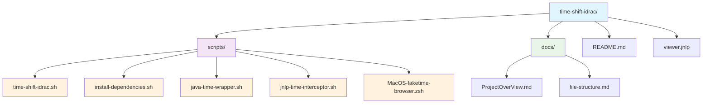

# Project File Structure

## File Descriptions

### Scripts Directory (`scripts/`)

- **time-shift-idrac.sh**: Main script that creates isolated namespace with time manipulation
- **install-dependencies.sh**: Dependency installation script for required tools
- **java-time-wrapper.sh**: Java wrapper that calculates time offset and launches Java with faketime
- **jnlp-time-interceptor.sh**: JNLP interceptor that handles Java Web Start with time manipulation
- **MacOS-faketime-browser.zsh**: Simple browser time-shifting example script

### Root Directory

- **README.md**: Installation instructions, usage workflow, and troubleshooting
- **viewer.jnlp**: iDRAC6 Virtual Console client configuration file

### Documentation Directory (`docs/`)

- **ProjectOverView.md**: Project requirements and technical specifications
- **file-structure.md**: This file - visual project structure diagram
