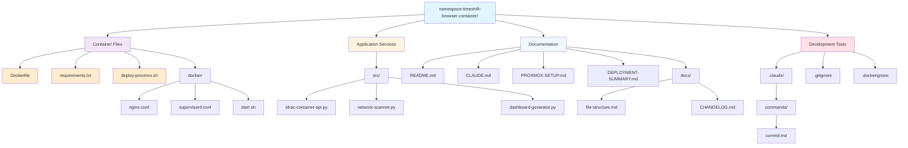

# Project File Structure



## File Descriptions

### Container Infrastructure

**Core container files for Proxmox deployment**

- **Dockerfile**: Multi-service container definition with nginx, Python API, and network scanner
- **requirements.txt**: Python dependencies (flask, requests, paramiko, python-nmap)
- **deploy-proxmox.sh**: One-command deployment script for Proxmox hosts
- **.dockerignore**: Excludes unnecessary files from container builds

#### Docker Configuration (`docker/`)
- **nginx.conf**: Web server configuration with API proxy and static file serving
- **supervisord.conf**: Service management for running multiple processes in container
- **start.sh**: Container startup script that initializes services and data

### Application Services (`src/`)

**Python services that run within the container**

- **idrac-container-api.py**: Flask REST API server for SSH key management and server operations
- **network-scanner.py**: Automated iDRAC discovery service that scans network every 5 minutes
- **dashboard-generator.py**: Creates responsive web interface for server management

### Documentation

**User and developer documentation**

- **README.md**: Main documentation with deployment instructions and feature overview
- **CLAUDE.md**: Development guidance for Claude Code instances with troubleshooting
- **PROXMOX-SETUP.md**: Detailed setup guide with advanced configuration options
- **DEPLOYMENT-SUMMARY.md**: Quick reference for one-command deployment

#### Extended Documentation (`docs/`)
- **file-structure.md**: This file - project organization and architecture
- **CHANGELOG.md**: Version history and feature additions

### Development Tools

**Version control and development workflow**

- **.gitignore**: Excludes generated files, logs, and sensitive data
- **.dockerignore**: Container build optimization

#### Claude Code Commands (`.claude/`)
- **commands/commit.md**: Smart commit command for automated version management

## Container Architecture

The solution uses a single Docker container with multiple managed services:

### Runtime Structure
```
Container (idrac-manager)
├── nginx (Port 80) ──────────► Web Dashboard
├── Python API (Port 8765) ───► REST API
├── Network Scanner ──────────► Auto-discovery
└── Supervisor ───────────────► Service Management
```

### Data Flow
```
User Browser ──► nginx ──► Static Dashboard
     │
     └── API Calls ──► Python API ──► iDRAC Operations
                                 │
                                 └── SSH Key Management
                                 └── Server Discovery
```

### Generated Files (Runtime)

The container creates files at runtime in `/app/www/`:

- **index.html**: Main dashboard interface (generated by dashboard-generator.py)
- **data/discovered_idracs.json**: Server database with timestamps and status
- **data/admin_config.json**: SSH key configuration and admin settings
- **downloads/**: User download area for connection scripts

## Deployment Architecture

### Proxmox Integration
```
Proxmox Host
├── Docker Engine
└── Container (idrac-manager)
    ├── Port 8080 ──► External Web Access
    ├── Port 8765 ──► Internal API (localhost only)
    └── Volume ─────► Persistent Data Storage
```

### Network Requirements
- **Host Network Access**: Container needs access to iDRAC servers on ports 80/443/22
- **External Access**: Users access web dashboard via Proxmox host IP on port 8080
- **Internal API**: API server only accessible from Proxmox host for security

## Migration from Legacy Solution

### Deprecated Files (Removed)
- ~~launch-idrac.sh~~ (macOS time-shifting script)
- ~~launch-virtual-console.sh~~ (Local virtual console launcher)
- ~~launch-timeshift-browser.sh~~ (Browser time-shifting)
- ~~run_unblock_and_execute.sh~~ (macOS quarantine workaround)
- ~~generate_easy_buttons.sh~~ (Local .command file generator)

### Architecture Changes
- **From**: macOS local scripts with time manipulation
- **To**: Containerized web services with direct SSL access
- **Benefits**: No quarantine issues, network-wide access, professional deployment

## Security Considerations

- **Container Isolation**: All services run within Docker container boundaries
- **Network Security**: API server only accessible from Proxmox host
- **Data Persistence**: Sensitive data stored in Docker volumes, not in git
- **SSH Key Security**: Keys generated and stored securely within container
- **Access Control**: Web dashboard provides read-only server information to users

## Development Workflow

### Container Development
1. **Edit source files**: Modify Python services in `src/`
2. **Update container**: Run `./deploy-proxmox.sh update`
3. **Test changes**: Access dashboard and verify functionality
4. **Commit changes**: Use `/project:commit` for version management

### Local Testing
```bash
# Build container locally
docker build -t idrac-manager:test .

# Run for testing
docker run -d --name test-container -p 8080:80 -p 8765:8765 idrac-manager:test

# Check logs
docker logs test-container

# Clean up
docker stop test-container && docker rm test-container
```

This architecture provides a professional, enterprise-ready solution that completely eliminates macOS-specific issues while offering superior functionality and accessibility.