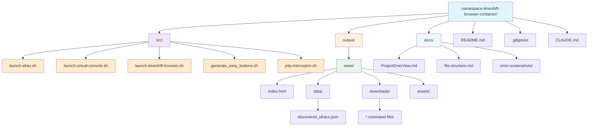

# Project File Structure



## File Descriptions

### Source Directory (`src/`)
**Scripts for time-shifted iDRAC access - not web accessible**

- **launch-idrac.sh**: Main all-in-one script with dependency management, network scanning, and dashboard generation
- **launch-virtual-console.sh**: Direct Virtual Console launcher with time shifting for specific IP addresses
- **launch-timeshift-browser.sh**: Browser-only time shifting for manual iDRAC access
- **generate_easy_buttons.sh**: Creates downloadable .command files for one-click Virtual Console access
- **jnlp-interceptor.sh**: JNLP file handler that applies time manipulation to Java processes

### Output Directory (`output/`)
**Generated files - excluded from source control via .gitignore**

#### Web Root (`output/www/`)
**Complete web-ready directory for nginx/Docker hosting**

- **index.html**: Main dashboard interface with dynamic server loading and download functionality
- **data/discovered_idracs.json**: Network discovery database with server status and timestamps
- **downloads/*.command**: Generated macOS command files for instant Virtual Console access
- **assets/**: Static web assets (CSS, JS, images) if needed

### Documentation Directory (`docs/`)

- **ProjectOverView.md**: Project requirements and technical specifications
- **file-structure.md**: This file - visual project structure diagram with web-ready organization
- **error-screenshots/**: Screenshots of SSL certificate errors and troubleshooting examples

### Root Directory

- **README.md**: Installation instructions, usage workflow, and troubleshooting guide
- **CLAUDE.md**: Development guidance for Claude Code instances
- **.gitignore**: Excludes generated output files containing network topology and security information

## Web Hosting Ready Structure

The `output/www/` directory is designed for direct web hosting:

### Docker Deployment
```dockerfile
FROM nginx:alpine
COPY output/www/ /usr/share/nginx/html/
EXPOSE 80
```

### Features
- **Complete Web Root**: Everything under `www/` is web accessible
- **Direct Downloads**: `.command` files downloadable via HTTP
- **Dynamic Data**: Dashboard loads server data via AJAX from `data/discovered_idracs.json`
- **Security**: Generated files excluded from source control to protect network topology

### Access Patterns
1. **Web Dashboard**: Navigate to hosted site for GUI management
2. **Direct Downloads**: Download `.command` files for offline use
3. **API Access**: Fetch JSON data programmatically via `/data/discovered_idracs.json`
