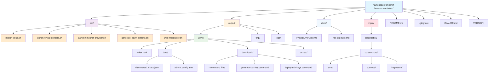

# Project File Structure



## File Descriptions

### Source Directory (`src/`)
**Scripts for time-shifted iDRAC access - not web accessible**

- **launch-idrac.sh**: Main all-in-one script with dependency management, network scanning, and dashboard generation
- **launch-virtual-console.sh**: Direct Virtual Console launcher with time shifting for specific IP addresses
- **launch-timeshift-browser.sh**: Browser-only time shifting for manual iDRAC access
- **generate_easy_buttons.sh**: Creates downloadable .command files for one-click Virtual Console access
- **jnlp-interceptor.sh**: JNLP file handler that applies time manipulation to Java processes

### Output Directory (`output/`)
**Generated files - excluded from source control via .gitignore**

#### Web Root (`output/www/`)
**Complete web-ready directory for nginx/Docker hosting**

- **index.html**: Main dashboard interface with dynamic server loading, SSH key management, and download functionality
- **data/discovered_idracs.json**: Network discovery database with server status and timestamps
- **data/admin_config.json**: Admin email and SSH key configuration storage
- **downloads/*.command**: Generated macOS command files for instant Virtual Console access
- **downloads/generate-ssh-key.command**: SSH key generation script with admin email
- **downloads/deploy-ssh-keys.command**: SSH key deployment script for all online servers
- **assets/**: Static web assets (CSS, JS, images) if needed

### Documentation Directory (`docs/`)

- **ProjectOverView.md**: Project requirements and technical specifications
- **file-structure.md**: This file - visual project structure diagram with web-ready organization

### Input Directory (`input/`)
**User-provided materials for debugging and development - excluded from source control**

#### Diagnostics (`input/diagnostics/`)
**Organized debugging materials for development assistance**

- **screenshots/error/**: Error screenshots for troubleshooting SSL certificates, browser issues, etc.
- **screenshots/success/**: Success state screenshots showing working configurations
- **screenshots/inspiration/**: Visual references and design ideas for UI/UX improvements

### Root Directory

- **README.md**: Installation instructions, usage workflow, and troubleshooting guide
- **CLAUDE.md**: Development guidance for Claude Code instances
- **VERSION**: Semantic version tracking for releases
- **.gitignore**: Excludes generated output files and temporary input materials

## Web Hosting Ready Structure

The `output/www/` directory is designed for direct web hosting:

### Docker Deployment
```dockerfile
FROM nginx:alpine
COPY output/www/ /usr/share/nginx/html/
EXPOSE 80
```

### Features
- **Complete Web Root**: Everything under `www/` is web accessible
- **Direct Downloads**: `.command` files downloadable via HTTP
- **SSH Key Management**: Email-based SSH key generation and deployment
- **Dynamic Data**: Dashboard loads server data via AJAX from `data/discovered_idracs.json`
- **Admin Configuration**: Persistent email and SSH key status in `data/admin_config.json`
- **Security**: Generated files excluded from source control to protect network topology

### Access Patterns
1. **Web Dashboard**: Navigate to hosted site for GUI management
2. **Direct Downloads**: Download `.command` files for offline use
3. **SSH Key Management**: Generate and deploy SSH keys via dashboard interface
4. **API Access**: Fetch JSON data programmatically via `/data/discovered_idracs.json` and `/data/admin_config.json`
