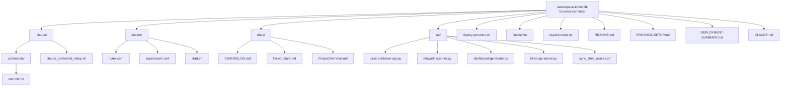

# File Structure

## Project Organization



## Directory Structure

```
namespace-timeshift-browser-container/
├── .claude/                      # Claude Code project commands
│   ├── commands/                 # Custom command definitions
│   │   └── commit.md            # Smart commit with version management
│   └── claude_command_setup.sh  # Command setup script
├── docker/                       # Container configuration files
│   ├── nginx.conf               # Web server configuration
│   ├── supervisord.conf         # Process management configuration
│   └── start.sh                 # Container startup script
├── docs/                         # Project documentation
│   ├── CHANGELOG.md             # Version history and changes
│   ├── file-structure.md        # This file - project organization
│   └── ProjectOverView.md       # Project overview documentation
├── src/                          # Application source code
│   ├── idrac-container-api.py   # REST API server for iDRAC operations
│   ├── idrac-api-server.py      # Alternative API server implementation
│   ├── network-scanner.py       # Network discovery service
│   ├── dashboard-generator.py   # Web dashboard generator
│   └── sync_shell_aliases.sh    # SSH alias management script
├── deploy-proxmox.sh            # Main deployment script for Proxmox
├── Dockerfile                   # Container build instructions
├── requirements.txt             # Python package dependencies
├── README.md                    # Project overview and quick start
├── PROXMOX-SETUP.md            # Detailed Proxmox deployment guide
├── DEPLOYMENT-SUMMARY.md       # Quick deployment reference
└── CLAUDE.md                   # Claude Code AI assistant instructions
```

## File Purposes

### Root Level Files

- **deploy-proxmox.sh**: Automated deployment script for Proxmox hosts
- **Dockerfile**: Multi-stage build for the iDRAC management container
- **requirements.txt**: Python dependencies for API and services
- **README.md**: Project overview, features, and quick start guide
- **PROXMOX-SETUP.md**: Comprehensive Proxmox deployment documentation
- **DEPLOYMENT-SUMMARY.md**: Quick reference for deployment steps
- **CLAUDE.md**: Instructions for Claude Code AI assistant

### .claude/ Directory

- **commands/commit.md**: Smart commit command with version management
- **claude_command_setup.sh**: Script to set up Claude commands

### docker/ Directory

- **nginx.conf**: Web server configuration for dashboard and API proxy
- **supervisord.conf**: Process management for container services
- **start.sh**: Container initialization and service startup

### docs/ Directory

- **CHANGELOG.md**: Version history and release notes (single source of truth for versioning)
- **file-structure.md**: Project organization documentation (this file)
- **ProjectOverView.md**: Detailed project overview and architecture

### src/ Directory

- **idrac-container-api.py**: Flask-based REST API for iDRAC management
- **idrac-api-server.py**: Alternative API server implementation
- **network-scanner.py**: Automated network discovery for iDRAC servers
- **dashboard-generator.py**: Dynamic HTML dashboard generator
- **sync_shell_aliases.sh**: SSH configuration and alias management

## Container Runtime Structure

When the container is running, it creates additional directories:

```
/app/                            # Container application root
├── www/                         # Web server document root
│   ├── index.html              # Generated dashboard
│   ├── data/                   # JSON data files
│   │   ├── discovered_idracs.json
│   │   └── admin_config.json
│   └── downloads/              # Generated download scripts
├── logs/                        # Application logs
└── src/                         # Mounted source code
```

## Data Persistence

The container uses Docker volumes for persistent data:

- **idrac-data**: Stores discovered servers and configuration
- **Container filesystem**: SSH keys in /root/.ssh/
- **Logs**: Available via docker logs command

## Legacy Files (Not in Container)

The following files exist in the repository but are not included in the containerized deployment:

- `output/` directory: Contains temporary browser profiles and generated files from the legacy macOS solution
- Various shell scripts replaced by Python implementations in the container